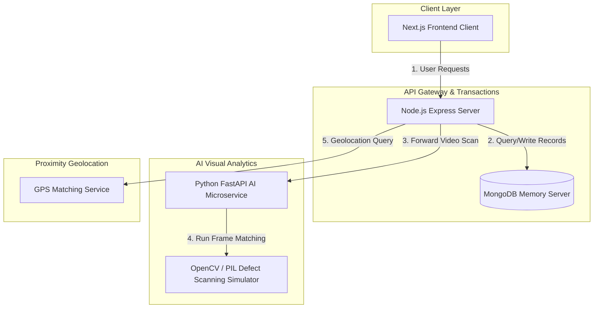

# Comprehensive Product Requirement Document (PRD): Amazon Resell & Circular Economy MVP

## 1. Executive Summary & Value Proposition

### The Problem
Traditional e-commerce returns and secondary customer-to-customer (C2C) marketplaces suffer from:
1. **High Logistics Overhead:** Returning items causes double shipping routes and high carbon footprint emissions.
2. **Trust & Quality Scarcity:** C2C marketplaces lack verification, leading to fraud, counterfeits, and chargebacks.
3. **Friction in Reselling:** Consumers discard usable items due to complex listing steps.

### The Solution: Amazon Resell
Amazon Resell integrates a verified C2C circular marketplace natively inside the core Amazon experience. By leveraging the **original purchase ledger**, the platform guarantees authenticity, automates visual inspections using AI, maps proximity donation opportunities, and tracks sustainability progress using a unified Green Wallet.

---

## 2. Product Feature Hierarchy

### 2.1. Micro-Features & Inputs (Tiny)
* **Visual Verification Code:** A unique 4-digit code (e.g. `AMZ-XXXX`) derived from the purchase record. The seller must show this code on a physical note or screen during their AI video scan, preventing the reuse of pre-recorded videos.
* **IMEI & Serial Number Indexing:** Mandatory 15-digit IMEI validator for phones and serial number checks for electronics. Tethers each listing to a specific physical asset.
* **"Listed for Resale" Ledger Locks:** A state locker that tags products inside order histories once return/resell is initiated, preventing duplicate listings or cash-refund abuse.
* **Proximity Zip Code Locator:** Auto-populates delivery coordinates from user profile details to calculate distance metrics.
* **Ecological Badge System:** Visual indicators (Bronze, Silver, Gold) awarded to products based on their manufacturer's sustainability index.

### 2.2. Component-Level Systems (Medium)
* **Custom Functional Diagnostic Checklists:** Custom checklists (e.g. testing bluetooth, audio driver, touchscreen) generated dynamically based on the specific product category.
* **Furniture Diagnosis Bypass:** Auto-detects home and office furniture items (e.g. ergonomic chairs) and bypasses hardware testing, routing them directly to cosmetic grading.
* **Proximity Delivery Matching:** Computes distances between seller and buyer zip codes to calculate real-time logistics constraints:
  - *Within 25 km:* Neighborhood local courier, 2-4 hours delivery.
  - *Metropolitan:* Next-day carrier delivery.
  - *Nationwide:* Standard transit (2-3 days).
* **Green Wallet Coupon Ledger:** A list storing active, generated shopping discount coupons (e.g. `AMZ-ECO-XXXX`) for purchase checkouts.

### 2.3. Major Core Engines (Large)
* **Amazon Resale Revenue Pricing Split:**
  - **Seller Payout:** Set by the seller.
  - **Amazon Platform Fee:** Computed at 10% of seller price (min ₹500, max ₹3000) to cover diagnostic escrows.
  - **Final Buyer Price:** Calculated as `Seller Payout + Resell Fee`, indexing in search grids.
* **FastAPI AI Condition Inspector:** A Python FastAPI service executing visual checks, cosmetic grading, and ownership confirmations on uploaded files.
* **Anti-Fraud Product Match Verification:** Compares the visual scan's brand, model, and color against purchase ledgers. Rejects publication if similarity falls below **70%**.
* **4-Vector Trust Engine:** Calculates individual trust scores:
  $$\text{Trust Score} = (\text{Purchase Verified} \times 0.3) + (\text{Ownership Confidence} \times 0.2) + (\text{Product Match Score} \times 0.2) + (\text{Cosmetic Score} \times 0.15) + (\text{Functional Score} \times 0.15)$$
* **AI Donation Routing Network:** Radius-based discovery (25km -> 50km -> 100km) matching items to nearby schools/libraries based on categorized needs and distance coefficients, complete with **AI Impact Stories** and printable **Certificates of Sustainability**.
* **Consolidated Sustainability Hub:** A tabbed dashboard (`/green-wallet`) combining available points balances, ledgers, coupon codes, active logistics tracking timelines, leaderboards, and seller listing catalogs.

---

## 3. System Architecture Topology



### Request Flow 1: AI Visual Verification & Return Routing
1. **Client** uploads a 10s MP4 check video to Express (`POST /api/orders/:id/evaluate-return`).
2. **Express** forwards the video buffer and purchase specs to FastAPI (`POST /analyze`).
3. **FastAPI** checks the video frames for verification code, cosmetic blemishes, and product match similarity.
   - If mismatch is detected (Similarity < 70%): FastAPI reports mismatch. Express returns HTTP 400 rejection block.
   - If match is confirmed (Similarity >= 70%): FastAPI returns grades. Express writes AIReport, credits wallet, and returns HTTP 200.

### Request Flow 2: Proximity NGO Distance Matching
1. **Client** requests nearby matching opportunities (`GET /api/sustainability/donation-places`).
2. **Express** calculates proximity bounds (radius searches from user delivery address).
3. **Express** queries databases for local charities matching the item category, computes a Match Score, and returns a sorted list.

---

## 4. Database Schema Specifications (TypeScript / Mongoose)

### 4.1. User Schema
```typescript
interface IUser {
  name: string;
  email: string;
  trustScore: number;
  currentCredits: number;
  lifetimeCredits: number;
  redeemedCredits: number;
  tier: 'Green Explorer' | 'Eco Warrior' | 'Carbon Hero' | 'Circular Champion';
  co2Saved: number;
  waterSaved: number;
  wastePrevented: number;
  refurbishedPurchases: number;
  greenActionsCount: number;
  rewardHistory: Array<{ activity: string; credits: number; co2Saved?: number; date: Date }>;
  couponsRedeemed: Array<{ code: string; reward: string; cost: number; date: Date }>;
}
```

### 4.2. Listing Schema
```typescript
interface IListing {
  order: mongoose.Types.ObjectId;
  seller: mongoose.Types.ObjectId;
  sellingPrice: number;
  buyerPrice: number;
  amazonFee: number;
  description: string;
  conditionNotes: string;
  images: string[];
  status: 'Active' | 'Sold';
  zipCode: string;
  trustScore: number;
  ownershipConfidence: number;
  productMatchScore: number;
  functionalScore: number;
  isPurchasedOnAmazon: boolean;
  isAiVerified: boolean;
  sustainabilityScore: number;
  sustainabilityBadge: 'Bronze' | 'Silver' | 'Gold';
  co2Savings: number;
}
```

### 4.3. Order Schema
```typescript
interface IOrder {
  user: mongoose.Types.ObjectId;
  productName: string;
  brand: string;
  category: string;
  purchaseDate: Date;
  originalPurchasePrice: number;
  productImage: string;
  orderId: string;
  deliveryStatus: string;
  returnStatus: 'None' | 'Return Initiated' | 'Returned';
  returnOption?: 'standard' | 'flexible' | 'hub';
  returnCreditsEarned?: number;
  sustainabilityScore: number;
  sustainabilityBadge: 'Bronze' | 'Silver' | 'Gold';
  co2Savings: number;
}
```

### 4.4. Donation Schema
```typescript
interface IDonation {
  user: mongoose.Types.ObjectId;
  order: mongoose.Types.ObjectId;
  productName: string;
  brand: string;
  category: string;
  productImage: string;
  conditionScore: number;
  conditionCategory: string;
  organizationName: string;
  organizationType: string;
  distanceKm: number;
  matchScore: number;
  beneficiariesHelped: number;
  beneficiaryType: string;
  co2Savings: number;
  wastePrevented: number;
  greenCreditsEarned: number;
  certificateId: string;
  status: 'Created' | 'Pickup Scheduled' | 'Picked Up' | 'Delivered' | 'Impact Recorded';
  timeline: Array<{ status: string; timestamp: Date; description: string }>;
  pickupAddress: string;
}
```

---

## 5. API Endpoint Specifications

| Endpoint | Method | Payload | Response | Description |
| :--- | :---: | :--- | :--- | :--- |
| `/api/auth/login` | `POST` | `{ email, password }` | `{ success, user }` | Authenticates tester sessions. |
| `/api/orders` | `GET` | *None* | `Array<Order>` | Fetches user purchase logs. |
| `/api/orders/:id/evaluate-return` | `POST` | `FormData [video, conditionScore, simulateMismatch]` | `{ success, analysis }` | Coordinates visual checks. |
| `/api/listings` | `POST` | `FormData [orderId, sellingPrice, conditionNotes, imei, serialNumber]` | `{ success, listing }` | Creates pre-owned offer. |
| `/api/sustainability/donation-places` | `GET` | *None* | `Array<NGO>` | Searches local coordinates radius. |
| `/api/donations` | `POST` | `{ orderId, organizationName, ... }` | `{ success, donation }` | Schedules NGO donation flow. |
| `/api/sustainability/redeem` | `POST` | `{ cost, reward }` | `{ success, coupon, user }` | Trades green wallet points for vouchers. |
